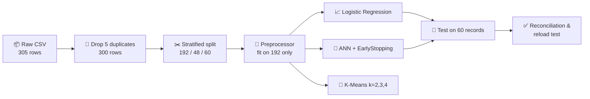
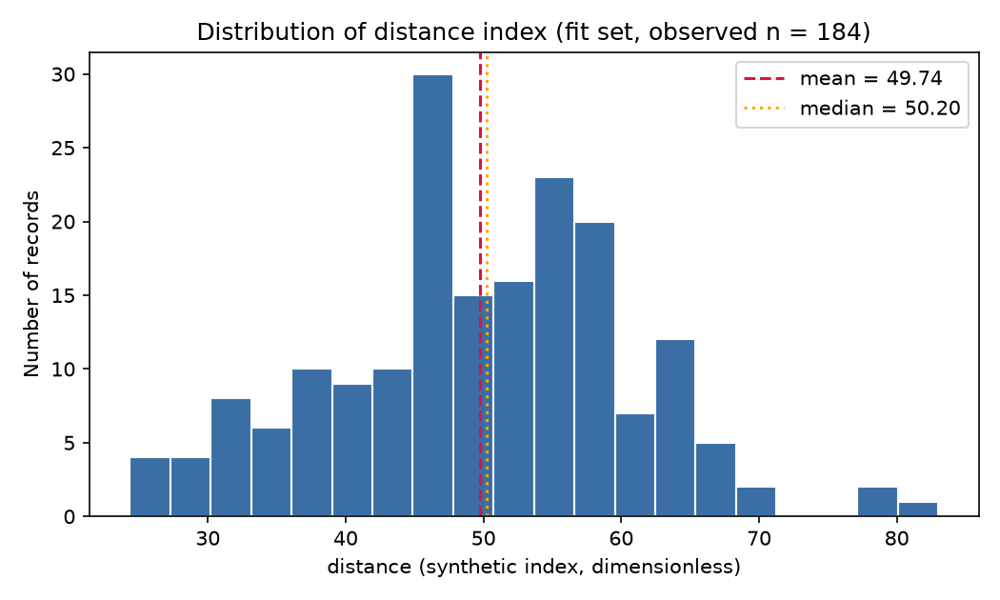
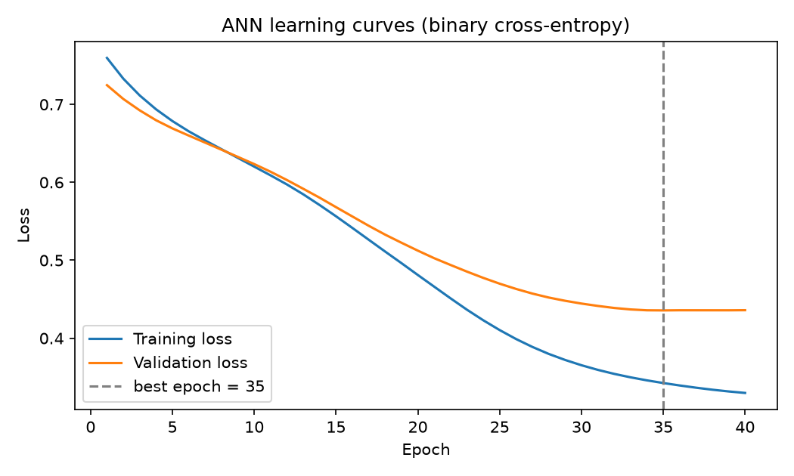
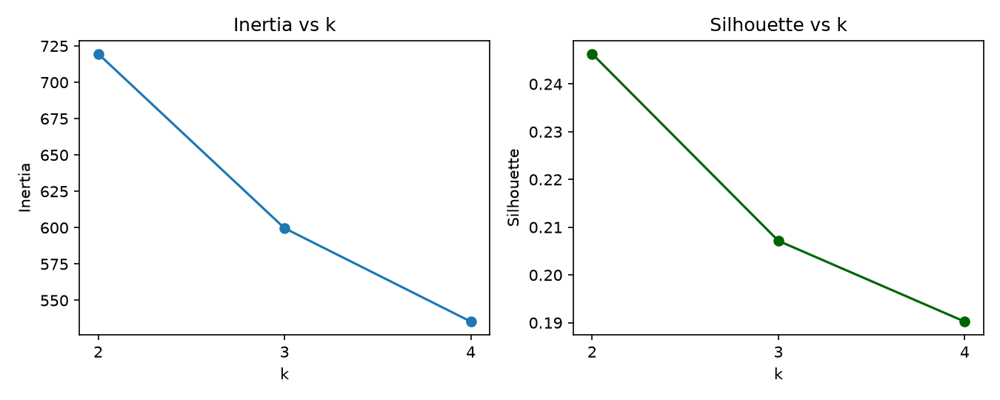
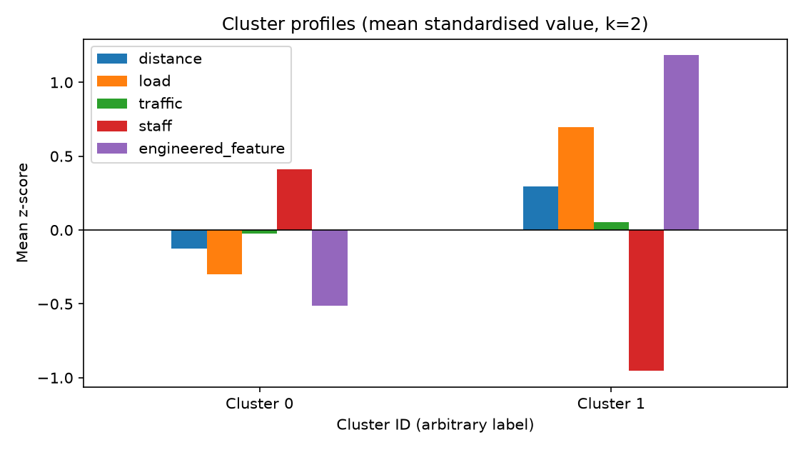
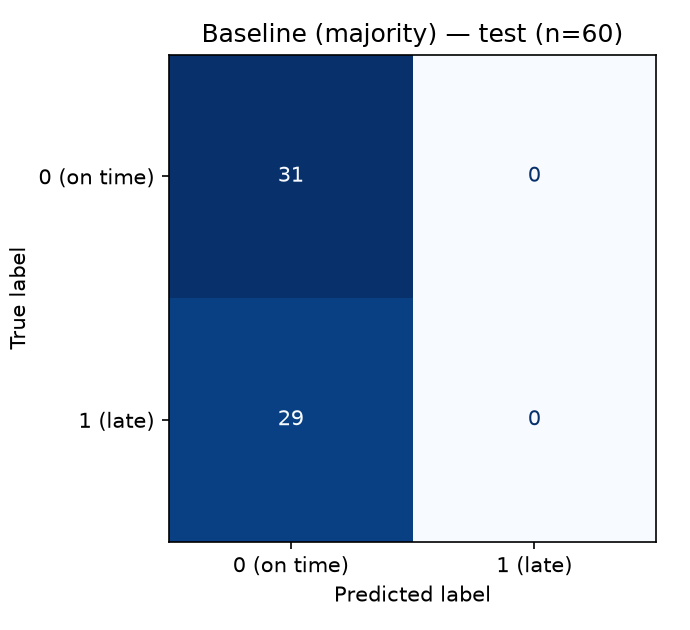
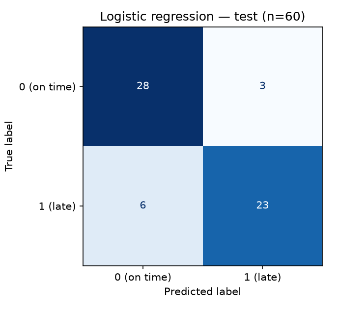
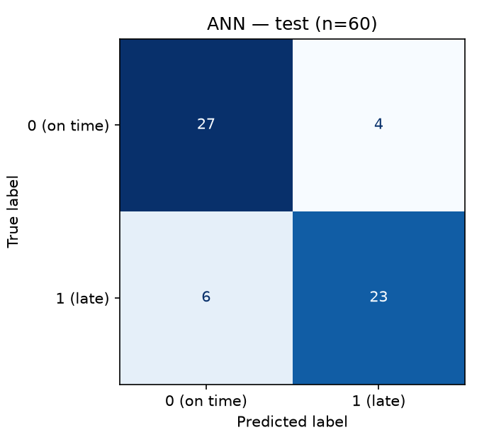

<div align="center">

# 🚚 Late-Delivery Prediction & Segmentation

### Data Science & AI/ML · Practical Exam · Set C


**Predict which deliveries will be late 📦⏰ and discover operational segments 🧩 — using classic ML and a small neural network.**

👤 **Student:** Krisha Anghan &nbsp;|&nbsp; 🆔 **ID:** 10771 &nbsp;|&nbsp; 📝 **Set:** C

[📓 Notebook](exam.ipynb) · [📊 Results](#-results-at-a-glance) · [🖼️ Figures](#-figures-gallery) · [🚀 Run it](#-how-to-run) · [⚠️ Limitations](#-limitations--honest-notes)

</div>

---

## 📑 Table of Contents

1. [🎯 Project Overview](#-project-overview)
2. [🏆 Results at a Glance](#-results-at-a-glance)
3. [🗂️ Project Structure](#️-project-structure)
4. [🔄 Pipeline](#-pipeline)
5. [🔬 Section-by-Section Walkthrough](#-section-by-section-walkthrough)
6. [🖼️ Figures Gallery](#️-figures-gallery)
7. [🚀 How to Run](#-how-to-run)
8. [💾 Load the Saved Models](#-load-the-saved-models)
9. [🛡️ Leakage Prevention](#️-leakage-prevention)
10. [⚠️ Limitations & Honest Notes](#-limitations--honest-notes)

---

## 🎯 Project Overview

> 💡 **Problem:** Predict whether a delivery will be **late** (`late = 1`) and identify **operational segments** from a synthetic logistics dataset.

| 🔹 Item | 📌 Detail |
|---|---|
| 📦 **Raw data** | 305 rows × 7 columns (incl. **5 exact duplicates**) |
| 🧹 **Clean data** | 300 unique records (155 on time · 145 late) |
| 🎯 **Target** | `late` (0 = on time, 1 = late) |
| 🔢 **Predictors** | `distance`, `load`, `traffic`, `staff`, `group` (G1/G2) + engineered `load / (staff + 1)` |
| 🕳️ **Missing values** | 15 in `distance` and 15 in `load` → median-imputed |
| ✂️ **Split** | 192 fit · 48 validation · 60 test (stratified, `random_state=42`) |
| 🌱 **Seed** | `42` everywhere |

> 🔔 All data are **synthetic practice observations** — no causal claims and no deployment-readiness claims are made.

---

## 🏆 Results at a Glance

### 🥇 Model comparison on the untouched 60-record test set

| 🤖 Model | 🎯 Accuracy | 🔍 Precision | 📡 Recall | ⚖️ F1 |
|---|:---:|:---:|:---:|:---:|
| 🪨 Baseline (majority class) | 0.517 | 0.000 | 0.000 | 0.000 |
| 📈 **Logistic Regression** ⭐ | **0.850** | **0.885** | 0.793 | **0.836** |
| 🧠 ANN (16 → 8 → 1) | 0.833 | 0.852 | 0.793 | 0.821 |

> 📌 Logistic regression's accuracy has a **Wilson 95 % CI of [0.739, 0.919]** — with only 60 test rows, the 1-record gap to the ANN is well within noise.

### 🧩 Segmentation (K-Means)

| 🏷️ Cluster | 👥 Size | 🧾 Profile | 💬 Name | 🛠️ Suggested action |
|:---:|:---:|---|---|---|
| **0** | 134 (69.8 %) | staff ↑, load ↓ | 🟢 *Well-staffed, lighter-load routes* | Keep staffing; lend spare capacity at peaks |
| **1** | 58 (30.2 %) | staff ↓, load ↑ | 🔴 *Understaffed, high-load routes* | Add / reassign staff; monitor for delay risk first |

> ⚠️ Silhouette is only **0.246** → the segments are soft, overlapping groups — a useful lens, not natural categories.

### 📐 Maths & Stats highlights

| 🧮 Task | 📊 Result |
|---|---|
| **M1** · `distance` (n = 184 observed) | mean **49.74** · median **50.20** · std **10.84** |
| **M2** · Welch t-test G1 vs G2 | t = 0.706, df = 169.2, **p = 0.481** → fail to reject H₀ |
| **M2** · 95 % CI for mean distance | **[48.17, 51.32]** |
| **M3** · Covariance eigen-analysis | largest λ / total variance = **52.3 %** (distance & traffic ≈ uncorrelated) |

---

## 🗂️ Project Structure

```text
ds-aiml-set-b-YOUR-STUDENT-ID/
│
├── 📓 notebooks/
│   └── exam.ipynb                    # Main notebook (all sections 0–6)
│
├── 🐍 src/
│   ├── generate_data.py              # Supplied data generator (unchanged)
│   └── preprocessing.py              # Preprocessor class (impute → engineer → scale → one-hot)
│
├── 🗃️ data/raw/
│   └── set_b.csv                     # Raw data (never modified)
│
├── 🤖 models/
│   ├── preprocessor.joblib           # Fitted preprocessing pipeline
│   ├── baseline_dummy.joblib         # Majority-class baseline
│   ├── logistic_regression.joblib    # Logistic regression
│   ├── ann_model.keras               # Full ANN model
│   ├── ann.weights.h5                # ANN weights
│   └── ann_predictions.csv           # ANN test predictions
│
├── 📤 outputs/
│   ├── 🖼️ figures/                   # 7 PNG figures
│   ├── data_audit.json               # Duplicates, missing values, partition sizes
│   ├── preprocessing_audit.json      # Fitted medians, scaler stats, shapes
│   ├── inference_results.json        # Welch t-test + confidence interval
│   ├── matrix_results.json           # Covariance & eigenvalues
│   ├── supervised_settings.json      # Model settings
│   ├── versions.json                 # Library versions used for the run
│   ├── splits.csv                    # record_id → fit / validation / test
│   ├── statistics_summary.csv        # M1 descriptive stats
│   ├── k_selection_scores.csv        # Inertia & silhouette for k = 2, 3, 4
│   ├── cluster_profiles.csv          # Segment profiles
│   ├── ann_training_history.csv      # Per-epoch loss / accuracy
│   ├── confusion_matrix_*.csv        # baseline, logistic, ANN
│   ├── predictions_logistic.csv      # LR test predictions
│   ├── predictions_ann.csv           # ANN test predictions
│   └── model_metrics_comparison.csv  # Final metric table
│
├── 📋 requirements.txt
└── 📖 README.md
```

---

## 🔄 Pipeline



### 🔧 Preprocessing order (all statistics learned on the 192 fit records only)

| Step | 🛠️ Operation |
|:---:|---|
| 1️⃣ | Median imputation of `distance`, `load`, `traffic`, `staff` |
| 2️⃣ | Feature engineering: `engineered_feature = load / (staff + 1)` |
| 3️⃣ | `StandardScaler` on the 5 numeric features |
| 4️⃣ | One-hot encode `group` (`handle_unknown="ignore"`), left **unscaled** |

➡️ Final feature matrix has **7 columns**: `distance, load, traffic, staff, engineered_feature, group_G1, group_G2`.

---

## 🔬 Section-by-Section Walkthrough

### 🧮 Section 1 — Maths & Advanced Statistics

- **M1 · Descriptive stats** — mean, median and sample std of `distance` on observed (non-imputed) fit values.
- **M2 · Inference** — Welch two-sided t-test between groups G1 and G2 (α = 0.05) plus a 95 % t-interval. Result: **no clear evidence** that mean distance differs by group (this is *not* proof they are equal). Shapiro–Wilk p = 0.143 doesn't contradict normality.
- **M3 · Linear algebra** — manual covariance matrix and `np.linalg.eigh` eigenvalues for (`distance`, `traffic`).

<div align="center">



*📊 Distribution of the distance index on the fit set*

</div>

### 🧼 Section 2 — Preprocessing & Feature Engineering

Duplicates removed **before** splitting, partitions verified as pairwise disjoint, and every transform fitted on the fit set only. Test-set means of the scaled features are *not* exactly 0 (e.g. `distance` ≈ −0.308), which is evidence that no test statistics leaked into the scaler. 🔒

### 📈 Section 3 — Supervised Learning

Majority-class `DummyClassifier` vs `LogisticRegression(max_iter=1000, random_state=42)` at a 0.5 threshold.

📌 **Logistic regression coefficients (standardised features):**

| Feature | Coef. | 📈/📉 |
|---|:---:|:---:|
| `traffic` | +1.855 | 📈 more late |
| `distance` | +1.174 | 📈 more late |
| `engineered_feature` | +0.946 | 📈 more late |
| `load` | +0.525 | 📈 more late |
| `staff` | −0.558 | 📉 less late |
| `group_G2` | +0.439 | 📈 more late |
| `group_G1` | −0.416 | 📉 less late |

**⚖️ FP vs FN:** a false negative (missed late delivery) is usually the costlier error in delivery operations, so recall for class 1 matters. A lower threshold could be explored — chosen on **validation** data, never on test.

### 🧩 Section 4 — Unsupervised Learning

K-Means on the 5 scaled numeric features (`n_init=10`, `random_state=42`). The rule: **highest silhouette wins, ties → smaller k**.

| k | 📉 Inertia | 🎯 Silhouette | Selected |
|:---:|:---:|:---:|:---:|
| **2** | 719.63 | **0.2463** | ✅ |
| 3 | 599.66 | 0.2071 | |
| 4 | 535.38 | 0.1902 | |

> ℹ️ Cluster IDs are arbitrary labels and are **not** the `late` classes — clustering never saw the target.

### 🧠 Section 5 — Deep Learning (ANN)

```text
Input(7) ➜ Dense(16, ReLU) ➜ Dense(8, ReLU) ➜ Dense(1, Sigmoid)      →  273 trainable parameters
```

| ⚙️ Setting | Value |
|---|---|
| Loss | Binary cross-entropy |
| Optimiser | Adam (lr = 0.001) |
| Batch size / max epochs | 16 / 50 |
| Early stopping | `val_loss`, patience = 5, `restore_best_weights=True` |
| Epochs actually run | **40** (best epoch = **35**) |
| Best `val_loss` | 0.4357 |

📉 Training loss keeps falling (≈ 0.33) while validation loss flattens at ≈ 0.436 → a **mild** generalisation gap, no sharp overfitting.

### ✅ Section 6 — Reconciliation & Evidence

- 🔁 Metrics are **recomputed from the saved prediction files** and match the comparison table exactly.
- 🆔 Test IDs are verified identical (and in identical order) for both models.
- 💾 The saved ANN + preprocessor are **reloaded from disk** and reproduce the saved test probabilities (`atol = 1e-6`).

### 🏁 Final preference: **Logistic Regression** 📈

Equal recall (23 of 29 late deliveries found), marginally higher precision/F1, only **8 parameters vs 273**, instant training, and directly interpretable coefficients. The ANN adds complexity without a measurable benefit for 7 tabular features and 192 training rows.

---

## 🖼️ Figures Gallery

### 🧠 ANN learning curves

<div align="center">

</div>

### 🧩 K selection & cluster profiles

<div align="center">

<br/><br/>

</div>

### 🟦 Confusion matrices (test set, n = 60)

<div align="center">

| 🪨 Baseline | 📈 Logistic Regression | 🧠 ANN |
|:---:|:---:|:---:|
|  |  |  |
| TN 31 · FP 0 · FN 29 · TP 0 | TN 28 · FP 3 · FN 6 · TP 23 | TN 27 · FP 4 · FN 6 · TP 23 |

</div>

---

## 🚀 How to Run

### 1️⃣ Clone / open the project

```bash
cd ds-aiml-set-b-YOUR-STUDENT-ID
```

### 2️⃣ Create a virtual environment

```bash
# 🪟 Windows
python -m venv .venv
.venv\Scripts\activate

# 🐧 macOS / Linux
python3 -m venv .venv
source .venv/bin/activate
```

### 3️⃣ Install dependencies

```bash
pip install -r requirements.txt
```

### 4️⃣ Launch the notebook

```bash
jupyter notebook notebooks/exam.ipynb
```

▶️ Run **all cells top-to-bottom**. If `data/raw/set_b.csv` is missing, the notebook runs `src/generate_data.py` automatically.

> 🧪 The exact library versions used for the recorded run are saved in [`outputs/versions.json`](outputs/versions.json).

---

## 💾 Load the Saved Models

```python
import joblib, pandas as pd
from tensorflow import keras
from src.preprocessing import Preprocessor   # needed to unpickle the preprocessor

prep = joblib.load("models/preprocessor.joblib")
ann  = keras.models.load_model("models/ann_model.keras")
logreg = joblib.load("models/logistic_regression.joblib")

# new_df needs the columns: distance, load, traffic, staff, group
X_new  = prep.transform(new_df)
p_late = ann.predict(X_new.to_numpy("float32"))      # 🧠 ANN probability of being late
p_lr   = logreg.predict_proba(X_new)[:, 1]           # 📈 Logistic-regression probability
```

---

## 🛡️ Leakage Prevention

| 🚫 Excluded / guarded | 💡 Why |
|---|---|
| 🎯 `late` (target) | Using it would let the model "see the answer" |
| 🆔 `record_id` | An arbitrary label that could encode generation order |
| 🧪 Test statistics | Imputer / scaler / encoder are `fit` on the 192 fit rows only |
| 🔎 Validation set | Used **only** for ANN early stopping |
| 🏁 Test set | Evaluated **once** per final model — no tuning, no seed hunting |

---
## 🎥 Project Demo

<div align="center">

[](https://drive.google.com/file/d/1-xPQj4pJBKIx7btKa9lhB7dbIi8QggGs/view?usp=sharing)

</div>

---

## ⚠️ Limitations & Honest Notes

- 🧪 **Synthetic data**, n = 300 — results do not transfer to real operations.
- 📏 Only a **60-record holdout** and a **single random split** → one record = 1.7 pp of accuracy.
- 🤝 The LR vs ANN gap (1 record) is **not** statistical evidence that either is better.
- 🧩 Clusters are weak (silhouette 0.246) — descriptive, not natural groups.
- 🔗 No causal claims; **not deployment-ready**.

---

<div align="center">

### 🙌 Made with 💙 by **Krisha Anghan** · ID **10771**

⭐ *Data Science & AI/ML · Practical Exam · Set C* ⭐

</div>
